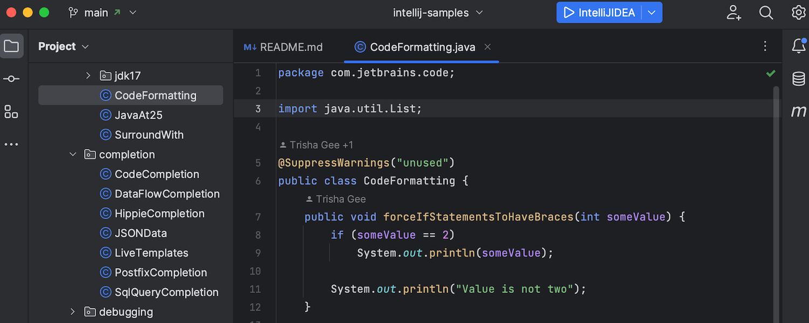

idea 2022.3 版本更新后，将新版UI的开关放在了设置中，可以直接尝试了。

<!--More-->

可以看到这界面有在尽力模仿vscode了，也把大部分平时根本不会用到的按钮都收起来了，界面看起来简洁了很多。但是编辑器的区域却没有变大，因为每个tab、按钮等都变得更大了。。。

IDEA里自带的设置是不能调整tab大小、列表项高度等等的设置的，只能借助第三方插件，其中最推荐的就是 `Material Theme UI` 。不过这个插件需要收费，免费版不能完成特殊设置。

为了配置列表项的高度，还需要 `Material Theme UI Extras` 插件，这个插件又需要额外收费。。。而且必须买了本体才可以用这个。
