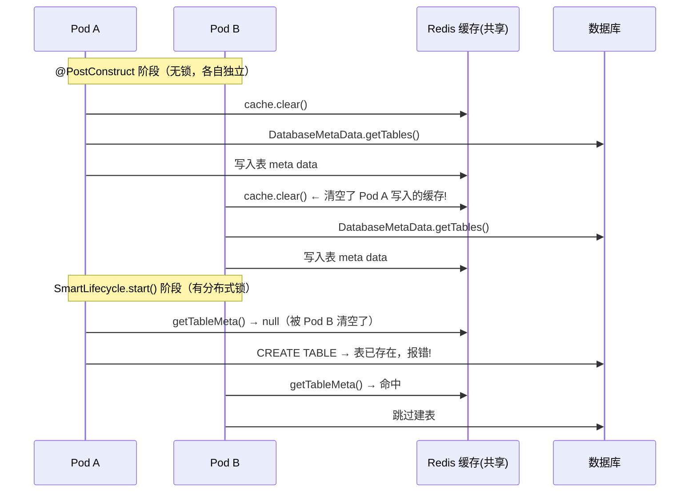
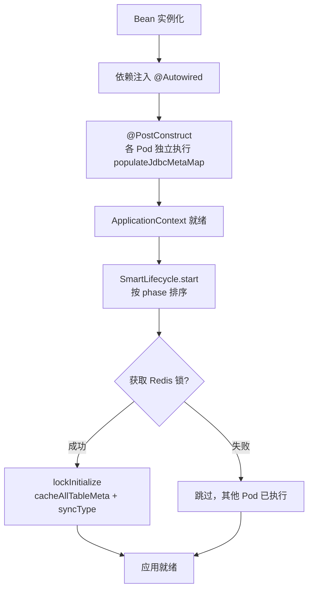
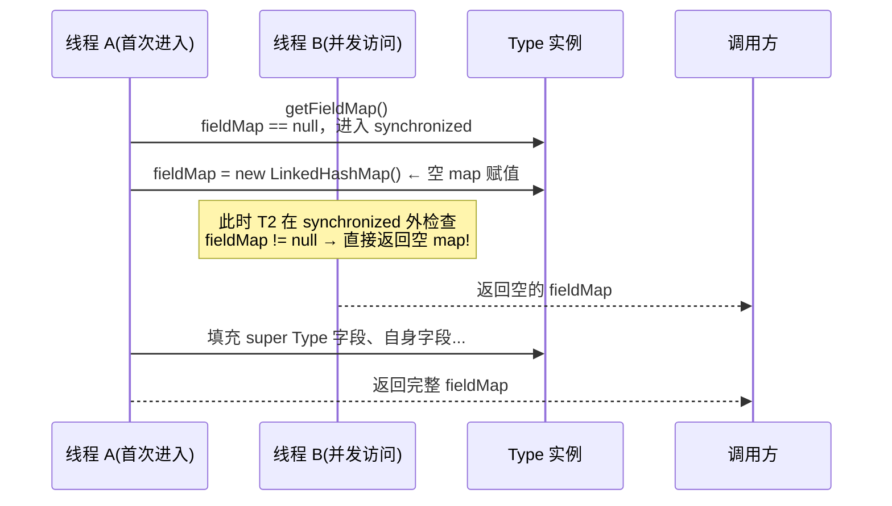
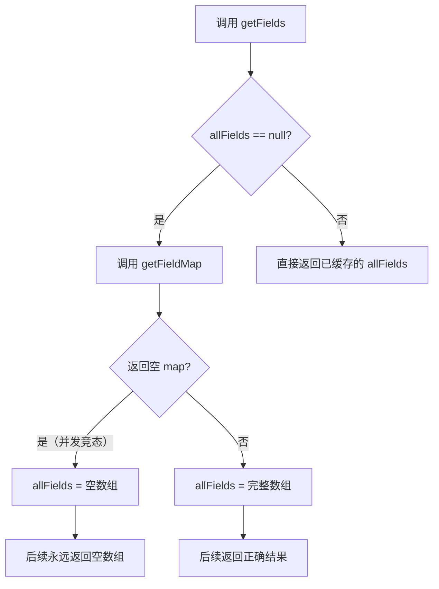
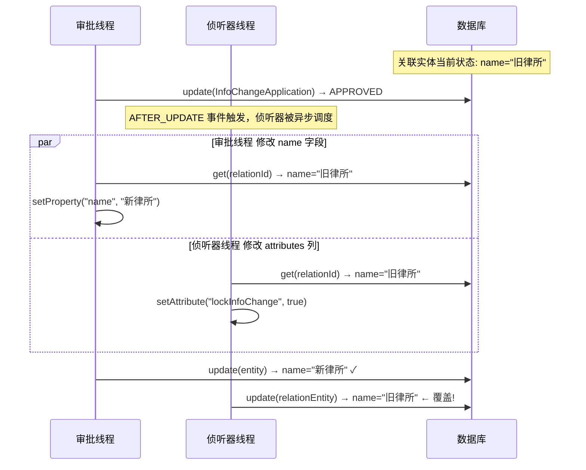
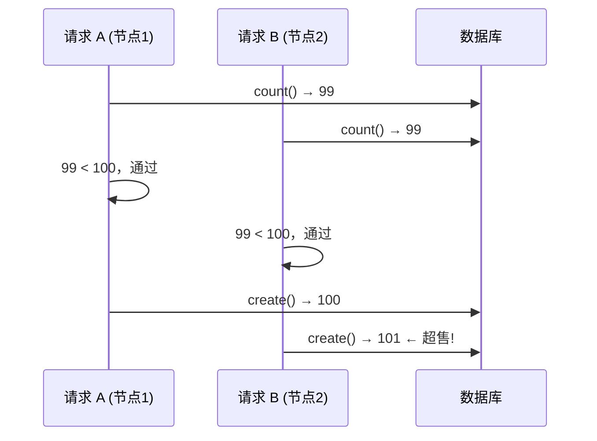
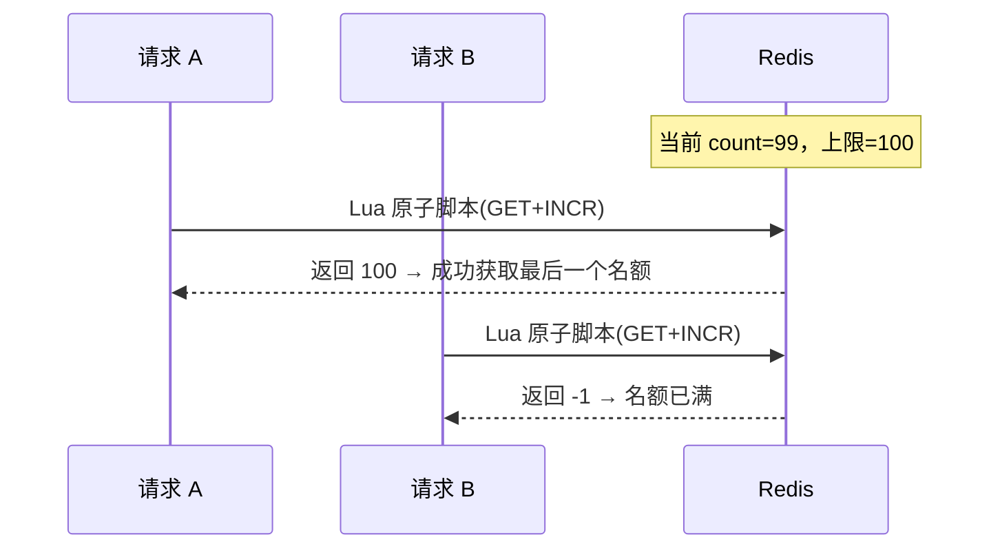
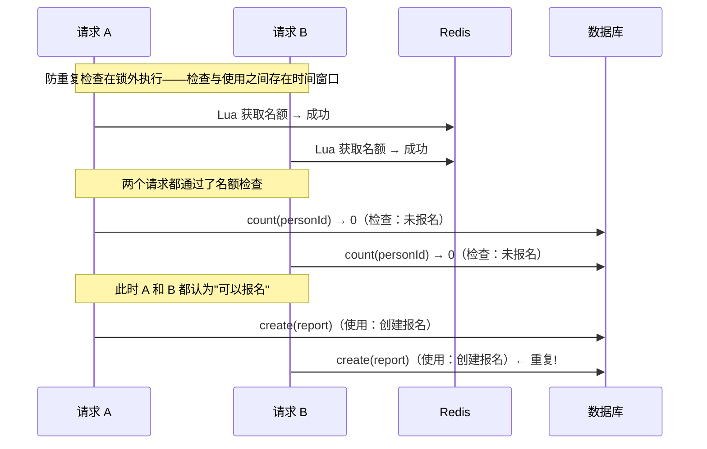

业务代码中的时序问题在本地单节点开发测试时几乎不会暴露。一旦部署到多副本、多节点环境，或者在前端频繁点击重试的场景下，就会以各种诡异的方式爆发。本文通过若干真实的排查案例，梳理常见的时序陷阱及其解法。

## 案例一：应用启动时重复建表

### 问题表现

Homolo Boot 框架的 `AutoSyncTableInitializer` 负责在应用启动时根据 meta data 自动创建数据库表。单节点运行时一切正常，部署到 K8s 多副本后，部分 Pod 启动失败，报错提示表已存在。

### 问题代码

`JdbcMetaHelper` 的 `cacheAllTableMeta()` 负责扫描数据库中已有表的 meta data 并写入 Spring Cache（多 Pod 共用同一份 Redis 缓存）。**这个方法在 `@PostConstruct` 中执行**：

```java
// JdbcMetaHelper — 修复前
@PostConstruct
public void init() {
    this.cache = this.cacheManager.getCache("jdbc_table_meta");
    initDomainModuleNames();
    populateJdbcMetaMap();
    cacheAllTableMeta();  // ← @PostConstruct 中执行
}

public synchronized void cacheAllTableMeta() {
    this.cache.clear();  // ← 第一步就清空共享缓存
    for (JdbcMeta jdbcMeta : this.jdbcMetaMap.values()) {
        // 通过 JDBC DatabaseMetaData 查询表列表
        // ...
        tableMetaMap.values().forEach(this::saveTableMeta);
    }
}
```

`AutoSyncTableInitializer` 继承自 `Initializer`（实现 `SmartLifecycle`），在 `SmartLifecycle.start()` 阶段通过分布式锁串行执行 `lockInitialize()`，遍历所有 Type 调用 `syncType()` 建表。但修复前 `lockInitialize()` **并没有调用 `cacheAllTableMeta()`**：

```java
// AutoSyncTableInitializer — 修复前
@Override
public void lockInitialize() {
    // cacheAllTableMeta() 在 @PostConstruct 中执行，这里没调用
    if (!this.dataModelProperties.isSyncEntityTable() || this.toolkitProperties.isTaskWebapp()) {
        return;
    }
    for (Type type : this.metaLoader.loadTypes()) {
        this.entityTableHelper.syncType(type);  // 遍历所有 Type 建表
    }
}
```

`syncType()` 从缓存获取表 meta data，判断是否需要建表——缓存命中则跳过建表，走列同步；缓存未命中则执行建表：

```java
// BaseTableExecutor.syncType() — 判断是否建表的核心逻辑
public void syncType(JdbcMeta jdbcMeta, Type type) {
    String tableName = EntityTableHelper.getTableName(type);
    // 从 Spring Cache（Redis）获取表meta data
    TableMeta tableMeta = this.jdbcMetaHelper.getTableMeta(jdbcMeta, tableName);
    if (tableMeta == null) {
        // ← 缓存为空 → 认为表不存在 → 执行建表
        tableMeta = initEntityTable(jdbcMeta, tableName, type.getFields());
        this.jdbcMetaHelper.saveTableMeta(tableMeta);
        return;
    }
    // 缓存命中 → 跳过建表，走列同步逻辑
}
```

`initEntityTable()` 通过 jOOQ 执行 `CREATE TABLE` DDL：

```java
// BaseTableExecutor.initEntityTable() — 建表的最终执行点
private TableMeta initEntityTable(JdbcMeta jdbcMeta, String tableName, Field[] rootTypeFields) {
    TableMeta tableMeta = new TableMeta(jdbcMeta.getName(), tableName);
    List<org.jooq.Field<?>> fieldList = new ArrayList<>(32);
    // 1. 添加系统列 (id, created_time, updated_time 等)
    for (EntitySystemColumn column : EntitySystemColumn.values()) {
        org.jooq.DataType sqlDataType = JOOQUtils.getSQLDataType(jdbcMeta,
            column.getColumnType(), column.getLength()).nullable(column.isNullable());
        fieldList.add(field(jdbcMeta.convertName(column.getName()), sqlDataType));
        tableMeta.addColumn(new TableMeta.Column(column.getName(), column.getColumnType(), ...));
    }
    // 2. 添加业务字段列
    fillColumnDuringInitTable(jdbcMeta, tableMeta, rootTypeFields, fieldList);
    // 3. 通过 jOOQ 执行 CREATE TABLE DDL
    try (CreateTableColumnStep step =
            jdbcMeta.getDslContext().createTable(table(jdbcMeta.convertName(tableName)))) {
        DDLQuery ddlQuery = step.columns(fieldList)
            .constraint(constraint(unquotedName(tableName + "_pkey"))
                .primaryKey(field(jdbcMeta.convertName(EntitySystemColumn.ID.getName()))));
        ddlQuery.execute();  // ← 表已存在时此处报错
        this.schemaScriptService.create(new SchemaScript(jdbcMeta.getName(),
            SchemaScript.Type.TABLE_ADD, ddlQuery.toString()));
    }
    // 4. 创建系统索引
    createSystemIndex(jdbcMeta, tableMeta);
    syncFieldColumnAfterInitTable(jdbcMeta, tableMeta, rootTypeFields);
    return tableMeta;
}
```

### 原因分析

多副本部署时，各 Pod 的 `@PostConstruct` 各自独立执行，互不知晓。`cacheAllTableMeta()` 的第一步就是 `this.cache.clear()`，会清空共享 Redis 缓存中所有表的 meta data。



Pod A 的 `syncType()` 查缓存时，共享缓存已被 Pod B 的 `cache.clear()` 清空。数据库层面表确实存在，但缓存层面 Pod A 看不到，于是触发了 `initEntityTable()`。

问题在于 `@PostConstruct` 阶段每个 Pod 都会独立执行 `cacheAllTableMeta()`，没有任何同步机制。当某个 Pod 的 `cache.clear()` 发生在其他 Pod 执行 `SmartLifecycle.start()` 之前或期间时，缓存数据就会被破坏。

### 修复

将 `cacheAllTableMeta()` 从 `@PostConstruct` 移至 `lockInitialize()` 方法。`Initializer` 的 `start()` 通过 Redis 分布式锁，保证多副本下只有一个 Pod 执行 `lockInitialize()`：

```java
// Initializer.start() — 框架基类
@Override
public void start() {
    this.running = true;
    initialize();
    if (this.redisLock == null) {
        lockInitialize();
    } else {
        String requestId = UUIDUtils.generateUUID();
        boolean locked = this.redisLock.tryLock(
            getClass().getName(), requestId, lockTimeout());
        if (!locked) {
            return;  // 其他 Pod 已在执行，跳过
        }
        try {
            lockInitialize();
        } finally {
            this.redisLock.unlock(getClass().getName(), requestId);
        }
    }
}
```

修复后的时序：



```java
// AutoSyncTableInitializer — 修复后
@Override
public void lockInitialize() {
    this.jdbcMetaHelper.cacheAllTableMeta();  // ← 移至锁保护下执行
    if (!this.dataModelProperties.isSyncEntityTable() || this.toolkitProperties.isTaskWebapp()) {
        return;
    }
    for (Type type : this.metaLoader.loadTypes()) {
        this.entityTableHelper.syncType(type);
    }
}
```

只有获取到分布式锁的 Pod 才会执行 `cacheAllTableMeta()` 和建表，其他 Pod 直接跳过。缓存不会被反复清空，也不会出现并发建表。

同时修复了一个关联 bug：多数据源遍历中某数据源无表时用了 `return` 跳出方法，导致后续数据源的缓存被跳过：

```java
// JdbcMetaHelper.cacheAllTableMeta() — 修复前
if (!exists) { return; }    // 跳出整个方法，后续数据源不会处理
// 修复后
if (!exists) { continue; }  // 仅跳过当前数据源，继续处理下一个
```

**要点：** 当多个实例共享一份外部资源时，任何"先清除再重建"的操作都需要加锁保护。`@PostConstruct` 中每个实例都会独立执行，无法互相同步，不适合放置此类操作。

## 案例二：双重检查锁定缺陷导致继承字段间歇性丢失

### 问题表现

Homolo Datamodel 的 `Type` 表示数据模型中的类型定义，支持类型继承。某个子 Type 声明继承 super Type 后，通过 `FieldService.reflect` 获取字段列表时，偶发性地只返回子 Type 自身声明的字段，丢失从 super Type 继承的字段。

问题的诡异之处在于：
- 不是每次都出现，而是**间歇性发生**
- 手动触发 `MetaLoader.reload()` 后立即可恢复
- 单线程调试时完全正常，应用启动后的并发访问阶段才暴露

### 问题代码

`Type` 类使用延迟加载缓存字段、业务、视图、动作等 meta data。以 `getFieldMap()` 为例，修复前使用了有缺陷的双重检查锁定（DCL）模式：

```java
// Type.java — 修复前
private Field[] ownFields;
private Field[] allFields;
private Map<String, Field> fieldMap;  // ← 未声明 volatile

public Map<String, Field> getFieldMap() {
    if (fieldMap != null) {          // ← 第一次检查（无锁）
        return fieldMap;
    }
    synchronized (this) {
        if (fieldMap == null) {       // ← 第二次检查（有锁）
            fieldMap = new LinkedHashMap<String, Field>();  // ← 先赋空 map
            com.homolo.datamodel.meta.Type superType = getSuper();
            if (superType != null) {
                for (Field obj : superType.getFields()) {
                    fieldMap.put(obj.getName(),
                        com.homolo.datamodel.meta.inherit.Field.create(this, obj));
                }
            }
            for (Field obj : getOwnFields()) {
                fieldMap.put(obj.getName(), obj);
            }
            // ← 填充过程中，其他线程可能读到空 map
        }
        return fieldMap;
    }
}

public Field[] getFields() {
    if (allFields == null) {
        allFields = getFieldMap().values().toArray(new Field[0]);  // ← 缓存空数组
    }
    return allFields;  // ← 一旦缓存了空结果，后续永久返回空
}
```

同样的缺陷还存在于 `getBusinessMap()`、`getViewMap()`、`getActionMap()`、`getDisplayField()`、`getChildren()`、`getExtendeds()` 等方法中。

### 原因分析

这段代码有三个层面的并发问题，叠加后导致继承字段间歇性丢失：

**问题一：`synchronized` 块内先赋空引用再填充数据**



线程 A 在 `synchronized` 块内先将 `fieldMap` 赋值为空的 `LinkedHashMap`，然后逐条 `put` 字段。此时线程 B 进入 `getFieldMap()`，在 `synchronized` 块外的第一次 `if (fieldMap != null)` 检查时看到**非 null 但为空**的 map，直接返回这个空 map——因为填充尚未完成，线程 A 仍持有锁，但锁外的第一次检查不会被阻塞。

**问题二：`fieldMap` 未声明 `volatile`**

即使线程 A 在 `synchronized` 块内完成了填充，Java 内存模型也不保证 `fieldMap` 的更新对其他线程立即可见。没有 `volatile` 修饰时，线程 B 可能永远看到 `fieldMap == null`，或者看到部分填充状态的 `fieldMap`。

**问题三：派生缓存 `allFields` 无同步保护**

`getFields()` 通过 `getFieldMap().values().toArray()` 生成 `allFields` 数组并缓存。如果 `getFieldMap()` 返回了空 map，`allFields` 就会被缓存为空数组。此后即使 `fieldMap` 被正确填充，`getFields()` 也永远返回空数组——因为 `if (allFields == null)` 不会再进入。



`DefaultMetaLoader.load()` 还有一个附带问题：`finally` 块中无条件设置 `State.Loaded` 并触发 `metaloaded` 事件，即使 `load()` 因状态不是 `NotLoaded` 而提前返回、实际未执行任何加载操作。

### 修复

修复分三个层面，覆盖所有存在同类缺陷的方法：

**第一层：缓存字段声明为 `volatile`**

```java
// Type.java — 修复后
private volatile Field[] ownFields;
private volatile Field[] allFields;
private volatile Map<String, Field> fieldMap;

private volatile Business[] ownBusinesses;
private volatile Business[] allBusinesses;
private volatile Map<String, Business> businessMap;

// viewMap、actionMap、displayField、children、extendeds 同理
```

`volatile` 保证跨线程可见性，一个线程写入 `fieldMap` 后，其他线程能立即看到最新值。

**第二层：使用局部变量填充，完成后再赋值给成员变量**

```java
// Type.java — 修复后
public Map<String, Field> getFieldMap() {
    Map<String, Field> result = this.fieldMap;   // ← 读取局部变量
    if (result != null) {
        return result;
    }
    synchronized (this) {
        if (this.fieldMap == null) {
            Map<String, Field> temp = new LinkedHashMap<String, Field>();  // ← 局部变量
            com.homolo.datamodel.meta.Type superType = getSuper();
            if (superType != null) {
                for (Field obj : superType.getFields()) {
                    temp.put(obj.getName(),
                        com.homolo.datamodel.meta.inherit.Field.create(this, obj));
                }
            }
            for (Field obj : getOwnFields()) {
                temp.put(obj.getName(), obj);
            }
            this.fieldMap = temp;  // ← 填充完成后再赋值
        }
        return this.fieldMap;
    }
}

public Field[] getFields() {
    Field[] result = this.allFields;   // ← 读取局部变量
    if (result == null) {
        result = getFieldMap().values().toArray(new Field[0]);
        this.allFields = result;       // ← 填充完成后再赋值
    }
    return result;
}
```

核心改动：在 `synchronized` 块内先用局部变量 `temp` 填充数据，填充完成后一次性赋值给 `this.fieldMap`。其他线程在 `synchronized` 块外检查时，要么看到 `null`（进入同步块等待），要么看到完整填充的 map——**永远不会看到"非 null 但为空"的中间状态**。

`getFields()` 同理，用局部变量 `result` 读取 `allFields`，避免在 `if (allFields == null)` 和后续使用之间被其他线程修改。

**第三层：setter 方法增加派生缓存清除**

```java
// Type.java — 修复后
public void setOwnFields(Field[] fields) {
    this.ownFields = fields;
    this.allFields = null;    // ← 清除派生缓存
    this.fieldMap = null;     // ← 清除派生缓存
    this.displayField = null; // ← 清除派生缓存
}

public void setOwnBusinesses(Business[] businesses) {
    this.ownBusinesses = businesses;
    this.allBusinesses = null;
    this.businessMap = null;
}

// setOwnViews、setOwnActions 同理
```

外部调用 `setOwnFields()` 等 setter 后，`allFields` 和 `fieldMap` 等派生缓存必须清空，否则下次 `getFields()` 会返回旧的缓存数据。

**附带修复：`DefaultMetaLoader.load()` 的状态守卫**

```java
// DefaultMetaLoader.java — 修复后
public void load() {
    boolean loaded = false;   // ← 增加 loaded 标志
    try {
        // ... 实际加载逻辑
        if (needReload) {
            // ... 执行加载
            loaded = true;
        }
        // 如果提前 return（如状态不是 NotLoaded），loaded 仍为 false
    } finally {
        if (loaded) {                    // ← 只有真正执行了加载才设置状态
            info.setState(State.Loaded);
            LOGGER.info("Metaloader is initialized...");
            eventTarget.fireEvent("metaloaded", this, true);
        }
        writeLock.unlock();
    }
}
```

### 总结

双重检查锁定（DCL）是 Java 并发编程中的经典模式，但实现细节决定成败。常见的陷阱：

| 陷阱 | 后果 | 正确做法 |
|------|------|---------|
| `synchronized` 块内先赋空引用再填充 | 其他线程读到"半初始化"对象 | 用局部变量填充，完成后一次性赋值 |
| 缓存字段未声明 `volatile` | 跨线程不可见，可能永远读到旧值 | 所有延迟加载的缓存字段加 `volatile` |
| 派生缓存未同步清除 | setter 修改源数据后派生缓存过期 | setter 中清除所有依赖的派生缓存 |
| `if (cache == null)` 读取后直接使用 | 检查和使用之间 cache 被修改 | 用局部变量读取，后续操作局部变量 |

**要点：** `synchronized` 只保证互斥访问，不保证"赋值原子性"。当赋值和填充是分步操作时，其他线程可能在 `synchronized` 块外看到中间状态。用局部变量完成构建后再一次性赋值，是消除这类竞态的标准做法。

## 案例三：全量更新覆盖导致的并发脏写

### 问题表现

某协会系统的档案管理模块中，信息变更申请（`InfoChangeApplication`）审批通过后，关联的档案实体（relation entity）字段值被莫名回退到旧值，看起来就像没有修改一样。

### 问题代码

审批通过时，`ApproveHandler.approve()` 方法在同一调用链中依次执行两步操作：

```java
// ApproveHandler.approve() — 审批通过的核心流程
default void approve(Entity entity, String currentStatus) {
    String nextStatus = this.getNextStatus(currentStatus);
    // ① 更新 InfoChangeApplication 状态 → 触发 AFTER_UPDATE_ENTITY 事件
    this.updateStatus(entity, nextStatus, null);
    if (StringUtils.equals(this.getFinalStatus(), nextStatus)) {
        // ② 将变更字段写入关联实体（仍在审批线程中，同步执行）
        this.executeChange(entity);
    }
}

default void updateStatus(Entity entity, String nextStatus, String opinion) {
    entity.setProperty(InfoChangeApplication.Fields.STATUS, nextStatus);
    // ...
    this.entityService().update(entity);  // ← 全量更新 InfoChangeApplication，触发 AFTER_UPDATE 事件
}

default void executeChange(Entity entity) {
    EntityCondition condition = new EntityCondition(InfoChangeRecord.ID);
    condition.setParentId(entity.getId());
    // → 调用 InfoChangeRecordUtils.doUpdate() 更新关联实体
    this.infoChangeRecordUtils().executeChange(this.entityService().list(condition));
}
```

① `updateStatus()` 内部调用 `entityService().update(infoChangeApplication)` 将状态设为 `APPROVED`——此操作触发 `AFTER_UPDATE_ENTITY` 事件。

② `executeChange()` 遍历所有变更记录，调用 `InfoChangeRecordUtils.doUpdate()` 将变更字段写入关联实体。

这两步都在**审批线程**中同步执行。然而，①触发的 `AFTER_UPDATE_ENTITY` 事件会**异步**调度侦听器（原因见下文），导致侦听器与②在不同的线程中更新同一个关联实体：

**路径一：审批线程通过 `InfoChangeRecordUtils.doUpdate()` 更新业务字段**

```java
// InfoChangeRecordUtils.doUpdate() — 修复前
private void doUpdate(Entity infoChangeRecord) {
    String relationTypeId = infoChangeRecord.getProperty(InfoChangeRecord.Fields.RELATION_TYPE_ID, String.class);
    String relationId = infoChangeRecord.getProperty(InfoChangeRecord.Fields.RELATION_ID, String.class);
    Entity entity = this.entityService.get(relationId, relationTypeId);

    List<Entity> changeFields = this.entityService.list(changeFieldsCondition);
    for (Entity changeField : changeFields) {
        String fieldName = changeField.getProperty(ChangeFields.Fields.FIELD_NAME, String.class);
        // ... 将变更后值写入 entity
        entity.setProperty(fieldName, value);
    }
    this.entityService.update(entity);  // ← 全量更新：写入 entity 的所有字段
}
```

`doUpdate()` 遍历 `InfoChangeRecord` 下所有变更字段，将新值写入 entity 后调用 `entityService.update(entity)`——这是一个全量更新，会将 entity 上**所有字段**（包括未变更的字段）写回数据库。注意此方法由 `approve()` 的②步直接调用，运行在审批线程中。

**路径二：`AFTER_UPDATE_ENTITY` 事件侦听器更新 `attributes` 列**

```java
// InfoChangeApplicationLockInfoChangeListener.handle() — 修复前
@Listener(typeId = InfoChangeApplication.ID,
    events = {AFTER_UPDATE_ENTITY, AFTER_UPDATE_ENTITY_PARTIAL})
public void handle(EventObject event) throws Exception {
    Entity infoChangeApplication = event.getFirstArgs();
    boolean lockInfoChange = !ArrayUtils.contains(UNLOCK_INFO_CHANGE_STATUS, status);

    List<Entity> infoChangeRecords = this.entityService.list(condition);
    for (Entity infoChangeRecord : infoChangeRecords) {
        String relationTypeId = infoChangeRecord.getProperty(InfoChangeRecord.Fields.RELATION_TYPE_ID, String.class);
        String relationId = infoChangeRecord.getProperty(InfoChangeRecord.Fields.RELATION_ID, String.class);

        Entity relationEntity = this.entityService.get(relationId, relationTypeId);
        relationEntity.setAttribute(LOCK_INFO_CHANGE_ATTR_NAME, lockInfoChange);
        this.entityService.update(relationEntity);  // ← 全量更新：写入 relationEntity 的所有字段
    }
}
```

当 `InfoChangeApplication` 的状态变更（如审批通过、驳回、撤回）时，侦听器被触发，遍历所有关联记录，更新关联实体的 `attributes` 列中的锁定标记。同样使用了 `entityService.update(relationEntity)` 全量更新。

**为什么 AFTER 侦听器在不同线程中执行？**

Homolo Boot 框架的 `EntityListenerActor` 中，`before` 事件在调用方线程中同步执行，而 `after` 事件通过 `@Async` 注解 + `TaskExecutor` 异步执行：

```java
// EntityListenerActor — 框架事件分发机制
// before 事件：同步执行，在调用方线程中串行调用各 listener
@EventListener(condition = "...BEFORE_EVENT_TYPES.contains(event.name)...")
public void beforeHandle(EventObject event) throws Exception {
    List<String> listeners = getListeners(event.getName(), entity.getTypeId());
    for (String className : listeners) {
        handle(className, event);  // 同步调用
    }
}

// after 事件：异步执行，提交到线程池
@Async  // ← Spring 异步调度，afterHandle 本身在异步线程中执行
@EventListener(condition = "...AFTER_EVENT_TYPES.contains(event.name)...")
public void afterHandle(EventObject event) {
    List<String> listeners = getListeners(event.getName(), entity.getTypeId());
    // taskExecutor.execute() 进一步为每个 listener 分配独立线程
    listeners.forEach(className -> this.taskExecutor.execute(() -> {
        handle(className, event);
    }));
}
```

`afterHandle()` 方法叠加了两层异步：外层 `@Async` 使方法本身在 Spring 的异步线程池中调度，内层 `taskExecutor.execute()` 为每个 listener handler 再分配一个独立线程。因此 `InfoChangeApplicationLockInfoChangeListener` 的执行与 `approve()` 中的 `executeChange()` 完全并行，二者同时更新同一个关联实体。

### 原因分析

如上所述，`approve()` 中 `updateStatus()` 触发的 AFTER 侦听器被框架异步调度到独立线程，而后续的 `executeChange()` → `doUpdate()` 仍在审批线程中同步运行。两条路径都通过 `entityService.get()` 加载完整的关联实体，各自修改部分字段后通过全量 `update()` 写回——任何一个路径写入较晚，都会将另一个路径的改动覆盖：



具体时序取决于两个线程的执行顺序，但核心问题是：

1. **审批线程**在 `doUpdate()` 中加载 entity 后修改了 `name` 字段，其他字段保持旧值
2. **侦听器线程**也加载了同一 entity（此时 `name` 可能已被审批线程更新，也可能还是旧值），修改了 `attributes` 中的 `lockInfoChange` 标记
3. 两个线程各自做全量 `update()`——谁后提交，谁就将自己的旧字段值覆盖到数据库

这种并行的根源在于框架将所有 AFTER 侦听器异步化，使得同一 `approve()` 调用链中的侦听器与后续业务逻辑天然处于不同线程中。

### 修复

将两条路径的全量 `update()` 改为只写入变更字段的 partial update：

**路径一修复：只更新实际变更的字段**

```java
// InfoChangeRecordUtils.doUpdate() — 修复后
private void doUpdate(Entity infoChangeRecord) {
    List<String> changedFieldNames = new ArrayList<>();
    for (Entity changeField : changeFields) {
        String fieldName = changeField.getProperty(ChangeFields.Fields.FIELD_NAME, String.class);
        entity.setProperty(fieldName, value);
        changedFieldNames.add(fieldName);  // ← 记录实际变更的字段
    }
    // 只写入变更的字段，避免全量更新将其他字段的旧值覆盖回数据库
    this.entityService.updatePartial(entity, changedFieldNames.toArray(new String[0]));
}
```

**路径二修复：只更新 `attributes` 列**

```java
// InfoChangeApplicationLockInfoChangeListener.handle() — 修复后
// 仅更新 attributes 列，避免全量 update() 将旧的业务字段值覆盖回数据库
Entity relationEntity = this.entityService.get(relationId, relationTypeId);
relationEntity.setAttribute(LOCK_INFO_CHANGE_ATTR_NAME, lockInfoChange);
this.entityService.directUpdatePartial(relationEntity, EntitySystemColumn.ATTRIBUTES.getName());
```

`directUpdatePartial` 直接指定要更新的列名，不依赖 entity 的变更跟踪机制，确保只写入 `attributes` 列。

### 要点

当多个代码路径可能更新同一实体时，全量 `update()` 等同于"读取当前全量状态 → 修改部分字段 → 写回全量状态"——任何在读取和写入之间到达的其他更新都会被覆盖。如果不需要写入全部字段，应使用 partial update 只写入变更的列，从根源上消除脏写窗口。

## 案例四：活动报名的竞态条件与名额超售

### 问题表现

某协会系统的活动报名功能上线后，运营反馈两个问题：
1. 报名人数经常超出设定上限（如上限 100 人，实际 102 人）
2. 同一用户偶尔出现两条报名记录

### 问题代码

原始报名逻辑是一个典型的"检查-再执行"模式，没有任何事务或锁保护。以 `ReportActionService.report()` 方法为例：

```java
// ReportActionService — 原始实现（简化）
public Message report(String eventId, String participantSigningInfo, Date now) {
    // 第一步：统计当前报名人数（包含已驳回的记录！）
    Condition condition = new Condition(Report.ID);
    condition.setParentId(eventId);
    int reportedNumber = this.entityService.count(condition);

    // 第二步：检查名额
    if (isLimitNumber) {
        int number = event.getProperty(Conference.MAX_SIGNUP_NUMBER, Integer.class);
        if (reportedNumber >= number) {
            return Message.fail("报名人数已达到上限");
        }
    }

    // 第三步：检查是否已报名
    String personId = UserSessionFactory.currentUser().getPersonId();
    condition.setProperty(Report.PERSON_ID, personId);
    if (this.entityService.count(condition) > 0) {
        return Message.fail("您已经报名了该活动");
    }

    // 第四步：自动通过时，先创建参会人记录
    Boolean autoPass = event.getProperty(Conference.AUTO_APPROVED, Boolean.class);
    if (autoPass) {
        Entity participant = new Entity(Participant.ID);
        // ... 设置 participant 属性
        this.entityService.create(participant);  // ← 第一次写入
    }

    // 第五步：再创建报名记录
    Entity entity = new Entity(Report.ID);
    entity.setParentId(eventId);
    entity.setProperty(Report.PERSON_ID, personId);
    // ... 设置 entity 属性
    this.entityService.create(entity);  // ← 第二次写入
    return Message.success();
}
```

四个关键问题：
1. `count()` 和 `create()` 之间没有事务，更没有锁——任何请求都可能在此间隙插入
2. **没有 `@Transactional` 注解**：创建 participant 和创建 report 是两次独立的数据库写入。如果第五步失败（如并发导致名额已满），第四步创建的 participant 已经提交，留下孤儿数据
3. 防重复检查在锁外执行，同一个 `eventId + personId` 的两次并发请求都可以通过检查，各自执行两次 `create()`
4. `count(condition)` 统计的是所有报名记录，没有排除已被驳回（REFUSE）的记录

### 原因分析

#### 名额超售



两个请求在不同节点同时执行 `count()`，都读到 99，都通过检查，各自创建记录，结果 101 人。

#### 重复报名

即使名额控制正确，用户快速双击或前端重试时，两个请求同时进入方法，都通过"是否已报名"的检查，各自创建记录。`entityService.create()` 没有唯一约束兜底，数据库会写入两条完全相同的报名记录。

#### 名额偏高

驳回的记录仍被计入总数，导致实际可报名人数少于显示值。

### 修复过程

#### 阶段一：Redis Lua 脚本实现原子名额分配

引入 `SignupLimitSupport`，用 Redis Lua 脚本将"检查上限 + 增加计数"合并为原子操作：

```java
// SignupLimitSupport — Lua 脚本：原子检查并增加
private static final String ACQUIRE_LUA_SCRIPT =
    "local signedCount = tonumber(redis.call('GET', KEYS[1])) "
    + "if signedCount == nil then return -2 end "
    + "local maxNumber = tonumber(ARGV[1]) "
    + "if signedCount >= maxNumber then return -1 end "
    + "local newCount = redis.call('INCR', KEYS[1]) "
    + "return newCount";
```

修复后的时序：



Lua 脚本在 Redis 中原子执行，`GET` 和 `INCR` 之间不会有其他请求插入，从根本上消除了竞态窗口。

报名流程调整为先获取名额再写入数据库，DB 失败时归还：

```java
boolean slotAcquired = false;
try {
    // 获取名额
    if (!this.signupLimitSupport.tryAcquireSlot(eventId, maxSignupNumber)) {
        return Message.fail("报名人数已达到上限");
    }
    slotAcquired = true;
    // ... 创建 participant（如 autoPass）
    // ... 创建 report
    return Message.success();
} catch (Exception e) {
    if (slotAcquired) {
        this.signupLimitSupport.returnSlot(eventId);  // DB 失败时归还名额
    }
    throw e;
}
```

同时修正统计逻辑，只统计有效状态（`countEffectiveReports`）：

```java
condition.addFieldExpression(Report.STATUS, Operator.IN,
    List.of(ReportStatus.WAIT_APPROVAL.name(), ReportStatus.PASS.name()));
```

#### 阶段二：多层防重复提交锁

阶段一解决了名额超售，但仍有问题——用户快速双击时，两个请求同时通过 Lua 脚本抢到名额，造成重复报名。

TOCTOU（Time of Check to Time of Use）窗口示意：



引入了**三层分布式锁**，将防重复检查置于锁内：

| 锁类型 | Key 构成 | 用途 |
|--------|---------|------|
| 报名防重复锁 | `eventId:personId` | 登录用户报名 |
| 匿名报名锁 | `eventId:sessionId` | 匿名用户报名 |
| 律所报名串行锁 | `eventId:workUnit` | 同一律所名额串行校验 |

```java
// 获取防重复提交锁（基于 eventId + personId）
String lockToken = this.signupLimitSupport.tryAcquireSignupLock(eventId, personId);
if (lockToken == null) {
    return Message.fail("正在处理中，请勿重复提交");
}
try {
    // 锁内检查，消除 TOCTOU 窗口
    if (this.signupLimitSupport.hasExistingReport(eventId, personId)) {
        return Message.fail("您已经报名了该活动");
    }
    // 锁内获取名额、创建 participant、创建 report
    // ...
} finally {
    this.signupLimitSupport.releaseSignupLock(eventId, personId, lockToken);
}
```

锁的值为随机 UUID token，释放时通过 Lua 脚本校验 token 一致性，防止误删其他请求的锁：

```lua
-- 安全释放：仅当锁仍属于当前持有者时才删除
if redis.call('GET', KEYS[1]) == ARGV[1] then
  return redis.call('DEL', KEYS[1])
else return 0 end
```

#### 阶段三：补齐遗漏路径

排查后发现以下路径缺少名额归还或锁保护：

- `cancel()` / `cancelForManager()`：取消报名时没有归还名额，导致 Redis 计数持续偏高
- `cancel()` / `cancelForManager()`：仅支持 Event 类型，找不到 Conference 类型的实体
- `cancelForManager()`：STAFF 权限检查硬编码 `Event.ID`，应改用 `entity.getTypeId()`
- 取消报名未判断是否已驳回，可能被重复归还

修复：

```java
// cancel/cancelForManager 中补齐
Boolean isLimitNumber = entity.getProperty(Event.IS_LIMIT_NUMBER, Boolean.class, false);
String reportStatus = reportEntity.getProperty(Report.STATUS, String.class);
if (isLimitNumber && !StringUtils.equals(ReportStatus.REFUSE.name(), reportStatus)) {
    this.signupLimitSupport.returnSlot(entityId);
}
```

同时 `cancel()` 和 `cancelForManager()` 增加了 Conference 类型的回退查找：

```java
Entity entity = this.entityService.get(entityId, Event.ID);
if (entity == null) {
    entity = this.entityService.get(entityId, Conference.ID);
}
```

#### 阶段四：数据库部分唯一索引兜底

Redis 层面的锁和 Lua 脚本是应用层防护，但如果应用重启、Redis 故障或代码有遗漏路径，仍然可能产生脏数据。数据库层面的唯一索引是最后一道防线。

实际使用的 SQL（Flyway 迁移 `V1.1__add_report_unique_index.sql`）：

```sql
-- MySQL 8.0+ 部分唯一索引（Functional Unique Index）
CREATE UNIQUE INDEX uq_cas_report_active_parent_person
    ON cas_report (
        parent_id,
        (CASE
            WHEN trash = 0
             AND p_status IS NOT NULL
             AND p_status <> 'REFUSE'
             AND p_person_id IS NOT NULL
             AND p_person_id <> ''
             AND p_person_id <> '匿名用户ID'
            THEN p_person_id
            ELSE NULL
        END)
    );
```

这不是普通的唯一索引，而是一个**部分唯一索引（Partial Unique Index）**——通过 `CASE WHEN` 表达式，只对满足条件的记录加唯一约束：

- `trash = 0`：排除已删除的记录（软删除不影响重复报名）
- `p_status IS NOT NULL AND p_status <> 'REFUSE'`：排除已驳回的记录（驳回后可以重新报名）
- `p_person_id IS NOT NULL AND p_person_id <> ''`：排除异常数据
- `p_person_id <> '匿名用户ID'`：排除匿名用户

**它解决的问题：**
- 当两个请求同时绕过应用层检查、同时执行 `INSERT` 时，唯一索引保证只有一条写入成功，另一条抛出 `DuplicateKeyException`
- 即使 Redis 完全不可用，数据库仍能阻止同一人对同一活动重复报名
- 驳回后允许重新报名（条件中排除了 `REFUSE` 状态的记录）
- 软删除后允许重新报名（条件中排除了 `trash != 0` 的记录）

**MySQL 版本注意：**
- **此索引需要 MySQL 8.0+**。MySQL 5.7 及以下不支持函数索引（Functional Index），无法在 `CREATE UNIQUE INDEX` 中使用 `CASE WHEN` 表达式。在 MySQL 5.7 上执行此 SQL 会报语法错误
- MySQL 8.0.13+ 引入了函数索引，使得可以通过 `CASE WHEN` 实现部分唯一索引，这是 PostgreSQL 的 `CREATE UNIQUE INDEX ... WHERE` 的等效替代方案
- 对于 MySQL 5.7 环境，只能使用普通唯一索引（如 `UNIQUE KEY (parent_id, p_person_id)`），但这会导致驳回或软删除后无法重新报名。此时建议依赖应用层的 Redis 锁 + Lua 脚本作为主要防护，唯一索引作为最基础的重复记录兜底

#### 补充：INSERT 时传入条件的局限性

有人可能会想：与其先 `SELECT COUNT` 再判断，不如在 `INSERT` 时带上条件，比如：

```sql
INSERT INTO signup_report (event_id, person_id, ...)
SELECT ?, ?, ...
WHERE (SELECT COUNT(*) FROM signup_report
       WHERE event_id = ? AND status IN ('WAIT_APPROVAL', 'PASS')) < 100;
```

这种方式**能解决的问题**：
- 将检查和写入合并为一条 SQL，消除了应用层 `count()` 和 `create()` 之间的竞态窗口
- 不需要 Redis 或分布式锁，纯数据库层面完成

**不能解决的问题**：
- **事务隔离级别的影响**：在 MySQL 默认的 `REPEATABLE READ` 隔离级别下，子查询的 `COUNT(*)` 读取的是事务开始时的快照。如果两个事务同时开始，各自读到 99，各自的 `INSERT` 都会成功——问题依旧。只有在 `READ COMMITTED` 级别下或加 `SELECT ... FOR UPDATE` 才能看到实时数据
- **SQL 非原子性**：上面的 `INSERT ... SELECT WHERE` 并非原子操作。MySQL 会先执行子查询，再决定是否执行 `INSERT`，两个步骤之间仍然可能被其他事务插入。真正原子的是 `INSERT IGNORE` 配合唯一索引，或者用存储过程+锁
- **无法返回明确的业务提示**：当 `INSERT` 因条件不满足而写入 0 行时，应用层只能知道"受影响行数为 0"，无法区分是"名额已满"还是"其他条件不满足"

**结论**：`INSERT` 带条件可以作为辅助手段，但不能替代原子操作或锁。最可靠的方案仍然是 **Redis Lua 脚本（应用层快速失败） + 唯一索引（数据库层兜底） + 分布式锁（复杂业务逻辑保护）** 的三层防护。

## 总结

四个案例的共同点：代码在单线程或单节点串行执行时完全正确，但并发环境下时序假设被打破。

| 问题类型 | 典型表现 | 核心解法 |
|---------|---------|---------|
| 共享资源上的多实例并发 | 重复建表、数据冲突 | `SmartLifecycle.start()` + 分布式锁 |
| 多数据源 `return` 误用 | 部分数据源被跳过 | `return` → `continue` |
| 双重检查锁定缺陷 | 继承字段间歇性丢失 | `volatile` + 局部变量构建后赋值 |
| `synchronized` 内赋空引用 | 其他线程读到半初始化对象 | 局部变量填充，完成后一次性赋值 |
| 派生缓存未清除 | setter 修改后缓存过期 | setter 中清除所有依赖的派生缓存 |
| 多路径全量更新覆盖 | 并发脏写、字段回退 | partial update 只写入变更列 |
| 检查-再执行竞态 | 名额超售、重复记录 | Redis Lua 脚本原子操作 |
| 锁内检查遗漏 | 防重复失效 | 检查必须在锁保护范围内 |
| 异常路径资源泄漏 | 计数不准、名额偏高 | try-catch-finally 补齐补偿 |
| 应用层防护遗漏 | 脏数据写入 | 数据库唯一索引兜底 |

核心原则：**永远不要假设"两个操作之间不会有其他线程插入"。如果这个假设很重要，就用 `volatile`、锁、原子操作或 partial update 来保证它。**
